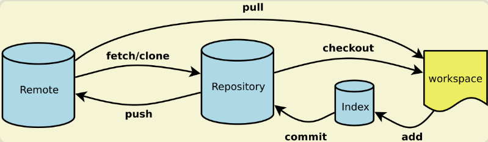
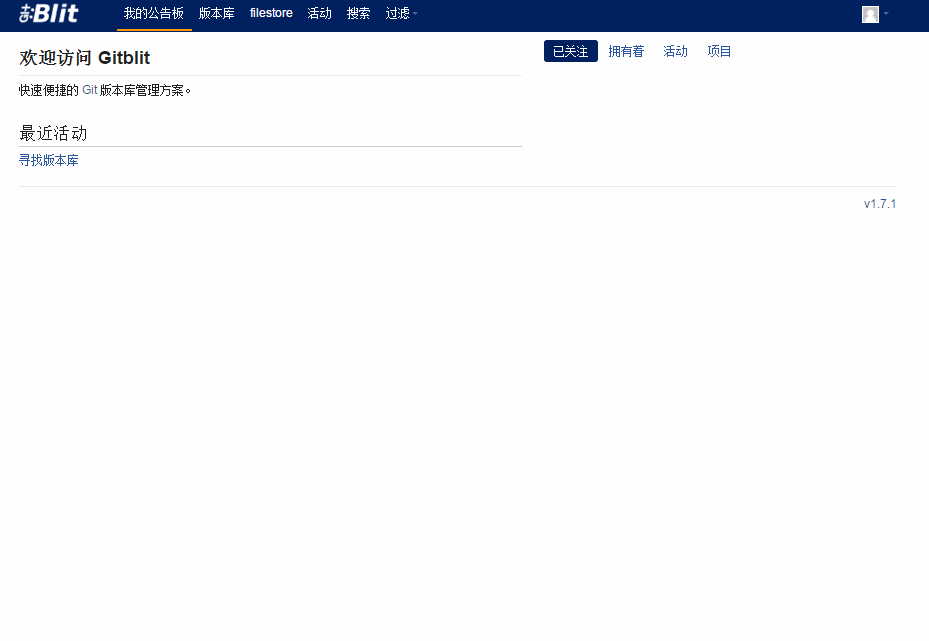
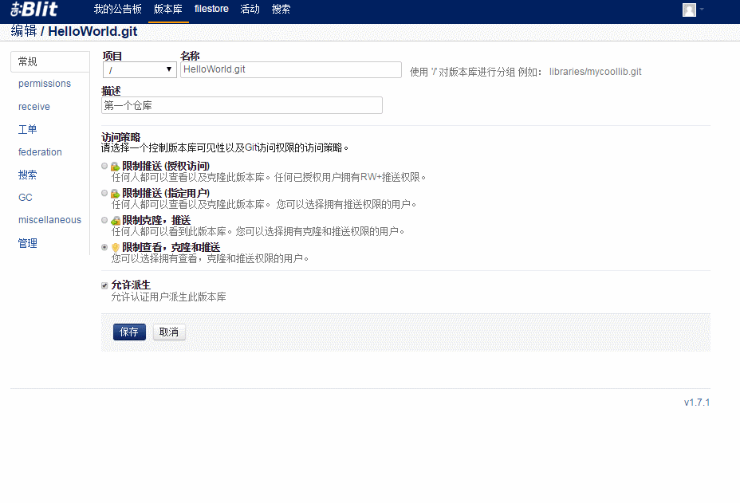

## Git介绍 ##
一种分布式的版本控制系统

参考网站:

* [Git中文教程](http://www.liaoxuefeng.com/wiki/0013739516305929606dd18361248578c67b8067c8c017b000)
* [Git常用命令](http://www.ruanyifeng.com/blog/2015/12/git-cheat-sheet.html)

## Git安装 ###

### Git常用命令 ###


* 新建代码库
	* git init (在当前目录新建一个Git代码库)
	* git init [project-name] (新建一个目录，将其初始化为Git代码库)
	* git clone [url] (下载一个项目和它的整个代码历史)
* 增加文件
	* git add [file1] [file2] ...(添加指定文件到暂存区)
	* git add . 添加当前目录的所有文件到暂存区
* 提交代码
	* git commit -m [message] (提交暂存区到仓库区)
	* git commit [file1] [file2] ... -m [message] (提交暂存区的指定文件到仓库区)
	* git commit -a (提交工作区自上次commit之后的变化，直接到仓库区)
* 分支
	* git branch (列出所有本地分支)
	* git branch -r (列出所有远程分支)
	* git branch [branch-name] （新建一个分支，但依然停留在当前分支）
	* git checkout -b [branch] （新建一个分支，并切换到该分支）
	* git checkout [branch-name] （切换到指定分支）
* 查看信息
	* git status（显示有变更的文件）
	* git log （显示当前分支的版本历史）
	* git log -3 (显示过去3次提交)
* 远程同步
	* git fetch [remote] ( 下载远程仓库的所有变动)
	* git remote add [remote] [url]（增加一个新的远程仓库，并命名）
	* git pull [remote] [branch] (取回远程仓库的变化，并与本地分支合并)
	* git push [remote] [branch] (上传本地指定分支到远程仓库)

### Git实战 (30 min)###

* 使用Git命令上传一个项目到Github


### Git GUI的使用 ###

### AS的Git插件使用 ###
1. 选择Git版本控制（菜单栏VCS -> Enable Version Control Integration -> Git）
2. 添加Git关联(重要)(Project->点右键->Git-> +Add)
3. 提交初始版本，并且选择远程仓库(重要)
4. 提交

### SourceTree的使用 ###
目前全球最好用的Git图形化界面

[下载地址](https://www.sourcetreeapp.com/)

[参考文档](https://www.atlassian.com/git/?_ga=1.35379362.2056744924.1467547469)

[范大叔教学视频](https://yunpan.cn/ckAnXFc3GSrRC)（提取码：5c9d）

### Git Flow ###
> master分支

    master分支上存放的应该是随时可供在生产环境中部署的代码

> develop分支

	develop分支是保存当前最新开发成果的分支

> feature分支

	feature分支（有时也可以被叫做“topic分支”）通常是在开发一项新的软件功能的时候使用，
    这个分支上的代码变更最终合并回develop分支或者干脆被抛弃掉。一般从develop分支拉出
    feature分支，功能模块开发完之后合并到develop分支。

> release分支

	release分支是为发布新的产品版本而设计的。在这个分支上的代码允许做小的缺陷修正、准
	备发布版本所需的各项说明信息（版本号、发布时间、编译时间等等）。可以从develop分支派生，
	必须合并回develop分支和master分支

> hotfix分支

	当生产环境中的软件遇到了异常情况或者发现了严重到必须立即修复的软件缺陷的时候，就需要
	从master分支上派生hotfix分支来组织代码的紧急修复工作。必须合并回master分支和develop分支。


## Git服务器Gitblit搭建 ##
Git服务器：Github, Coding, CSDN Code

### 安装 ###
* gitblit属于绿色软件，解压即可使用

### 配置 ###
* 端口配置。打开解压后的文件目录，找到data下gitblit.properties文件，添加内容如下
	
	```
	server.httpPort = 8888
	server.httpsPort = 8889
	```
	> server.httpPort 指的是http的端口号，可以按照自己的需求随意设置
	> server.httpsPort 指的是https的端口号，可以按照自己的需求随意设置


* 安装和配置服务。（此方式安装后，以后服务会自动重启，不用再配置）
	* 安装：打开解压后的文件目录，找到 installService.cmd脚本文件，双击即可运行。
	* 检测是否已经安装成功：
		* 桌面 ---> 计算机---> 右键 ---> 管理
		 
		如果存在gitblit说明存在此服务。右键-->属性
		
		按图配置
* 手动启动
	* 如果启动服务失败，那就点击gitblit.cmd启动服务器。当电脑重启后，需要再次点击启动服务器，不能向服务那样开机自启动

## 使用Gitblit
### 登录
 打开浏览器输入 http://localhost:8888/ 可进入管理界面
	
 默认用户名: admin 和 密码: admin

  
### 仓库创建


### 新建用户


### 给仓库添加用户
